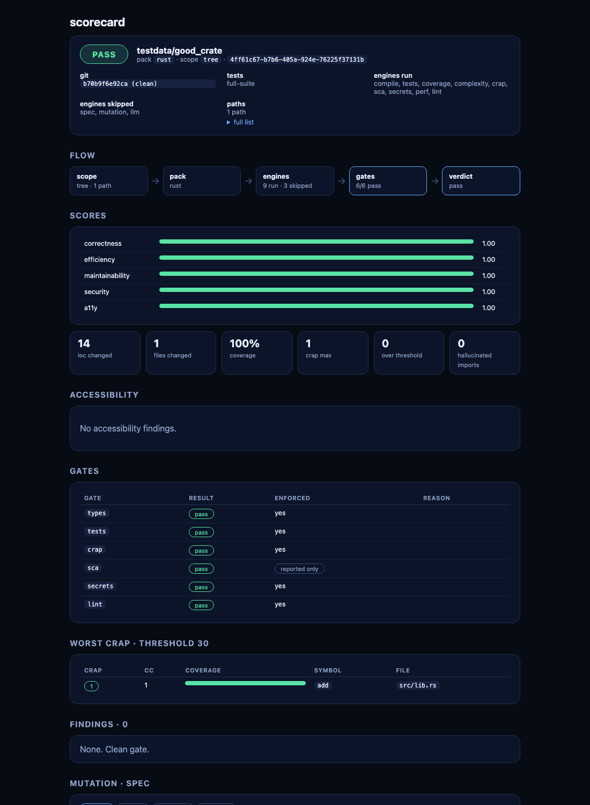

# Scorecard

[](https://github.com/moonbase2090/Scorecard/actions/workflows/ci.yml?query=branch%3Amain)
[](LICENSE)
[](https://github.com/moonbase2090/Scorecard/blob/main/Cargo.toml)

`sc` checks that a project type-checks, its tests pass, coverage and [CRAP](docs/crap.md) stay in bounds, secrets are absent, and the linter is clean. It also reports undeclared dependencies. Nine language packs are built in. The report is for AI coding agents and for CI. The project site is [scorecardcli.com](https://scorecardcli.com).

## Install

Release [v0.1.0](https://github.com/moonbase2090/Scorecard/releases/tag/v0.1.0).

macOS, Apple silicon and Intel in one disk image: [sc-v0.1.0-universal-apple-darwin.dmg](https://github.com/moonbase2090/Scorecard/releases/download/v0.1.0/sc-v0.1.0-universal-apple-darwin.dmg). Double-click `Install Scorecard.pkg` inside it, or download the package directly: [sc-v0.1.0-macos.pkg](https://github.com/moonbase2090/Scorecard/releases/download/v0.1.0/sc-v0.1.0-macos.pkg). Both install `sc` and `sc-mcp` to `/usr/local/bin`.

Each `.tar.gz` contains `sc`, `sc-mcp`, `LICENSE`, and `README.md` at the top of the archive.

Apple silicon:

```bash
curl -fsSLO https://github.com/moonbase2090/Scorecard/releases/download/v0.1.0/sc-v0.1.0-aarch64-apple-darwin.tar.gz
tar -xzf sc-v0.1.0-aarch64-apple-darwin.tar.gz
./sc --version
```

Intel Mac: `sc-v0.1.0-x86_64-apple-darwin.tar.gz`. Linux: `sc-v0.1.0-aarch64-unknown-linux-gnu.tar.gz` and `sc-v0.1.0-x86_64-unknown-linux-gnu.tar.gz`. Same `curl` and `tar` steps.

Check the published sums. `SHA256SUMS` lists every asset, so tell the checker to skip the ones you didn't download. Run this in the same directory, keeping the original file name. On macOS:

```bash
curl -fsSL -O https://github.com/moonbase2090/Scorecard/releases/download/v0.1.0/SHA256SUMS
shasum -a 256 -c --ignore-missing SHA256SUMS
```

On Linux, `sha256sum -c --ignore-missing SHA256SUMS`. Each file you downloaded should print `OK`.

### From source

Rust 1.85 or newer.

```bash
cargo build --release -p sc-cli -p sc-mcp
```

The binaries are `target/release/sc` and `target/release/sc-mcp`. `cargo install --path crates/sc-cli` and `cargo install --path crates/sc-mcp` put them on `PATH`.

Rust coverage also needs `rustup component add llvm-tools` and `cargo install cargo-llvm-cov`. On older toolchains the component is named `llvm-tools-preview`. If either tool is missing, `sc` still runs. Function coverage is treated as 0, a `coverage.missing` warning is recorded, and CRAP is still computed. The process exits 2 only when a required gate (`types` or `tests`) cannot run.

## Quickstart

```bash
sc analyze .
```

Exit 0 means the configured gates passed. Exit 1 means a gate failed. Exit 2 means the analyzer itself could not run.

## Sample

`sc analyze testdata/good_crate --format pretty` on a terminal. Color is off in this copy. The same run and `testdata/failing_test` are in [examples/terminal](examples/terminal/).

```text
sc 0.1.0  testdata/good_crate  rust  5ac851c clean  scope tree

PASS

gates
  [ok]  types            enforced
  [ok]  tests            enforced
  [ok]  crap             enforced
  [ok]  sca              advisory
  [ok]  secrets          enforced
  [ok]  lint             enforced

scores
  correctness      1.00  [##########]
  efficiency       1.00  [##########]
  maintainability  1.00  [##########]
  security         1.00  [##########]

worst crap  threshold 30
  CRAP   CC   COV  SYMBOL            LOCATION
     1    1  100%  add               src/lib.rs

findings
  (none)

engines run: compile, tests, coverage, complexity, crap, sca, secrets, perf, lint
engines skipped: spec, mutation, llm
duration: 0.7s
exit 0: gates passed
```

## HTML report

`sc analyze testdata/good_crate --format html --out scorecard.html` writes one self-contained page. The flow strip is the row under the header: scope, pack, engines, gates, and verdict.



The same command with `--format all --out scorecard.html` also writes `scorecard.json`, `scorecard.md`, and `scorecard.sarif`. Details are in [HTML report](docs/html-report.md).

## Languages

| Pack | Marker |
|---|---|
| Rust | `Cargo.toml` |
| Node | `package.json` |
| Python | a Python manifest |
| Bash | a top-level, `scripts/`, or `bin/` shell file, and no other marker |
| Go | `go.mod` |
| Java | `pom.xml` or Gradle |
| C# | a root `.csproj` or `.sln` |
| PHP | `composer.json` |
| C++ | `CMakeLists.txt` |

One pack per tree. Two markers and no override is an error. Details are in [packs](docs/packs.md).

## MCP

`sc-mcp` speaks MCP over stdio. It serves `analyze_paths`, `analyze_diff`, `explain`, and `list_findings`. `explain` and `list_findings` read `.sc/last-scorecard.json`.

Claude Code, stdio, verified with `claude mcp add --help`:

```bash
claude mcp add sc -- sc-mcp
```

Cursor reads `~/.cursor/mcp.json`. `sc setup` writes this shape, with the absolute path of the binary:

```json
{
  "mcpServers": {
    "sc": {"command": "sc-mcp", "args": []}
  }
}
```

More is in [MCP](docs/mcp.md).

## GitHub Action

```yaml
- uses: moonbase2090/Scorecard/action@v0.1.0
  with:
    fail-on: types,tests,crap,secrets,lint
    format: sarif
```

`moonbase2090/Scorecard/action@v0.1.0` is the `action/action.yml` on the `v0.1.0` tag. `sca` is advisory and is not in the default `fail-on` list. With `format: sarif` or `all`, the SARIF report is uploaded.

| Input | Default | Notes |
|---|---|---|
| `spec` | `""` | Path to a spec or task file |
| `fail-on` | `types,tests,crap,secrets,lint` | Comma-separated gates that fail the process |
| `mutation` | `off` | `off`, `diff`, or `full` |
| `format` | `sarif` | `json`, `md`, `sarif`, `html`, or `all` |
| `diff` | `""` | Git base ref; empty skips `--diff` |

## More

- [Examples](examples/README.md)
- [Packs](docs/packs.md)
- [Config](docs/config.md)
- [MCP](docs/mcp.md)
- [CRAP](docs/crap.md)
- [HTML report](docs/html-report.md)

## License

Scorecard is licensed under the [Mozilla Public License 2.0](LICENSE). You can use it in commercial products. If you distribute modified MPL-covered files, you must make their source available under MPL-2.0.
